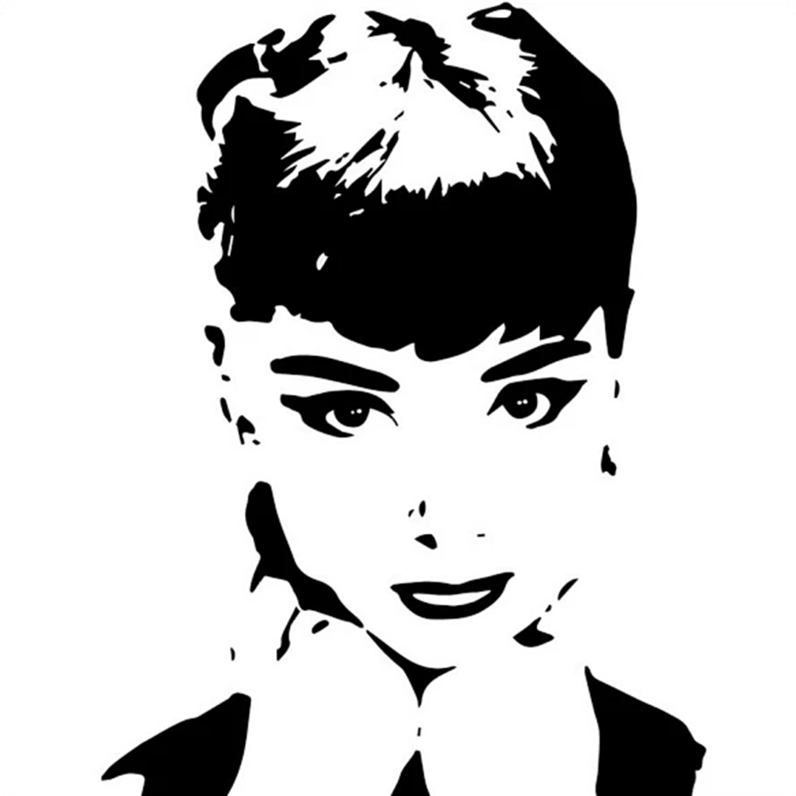
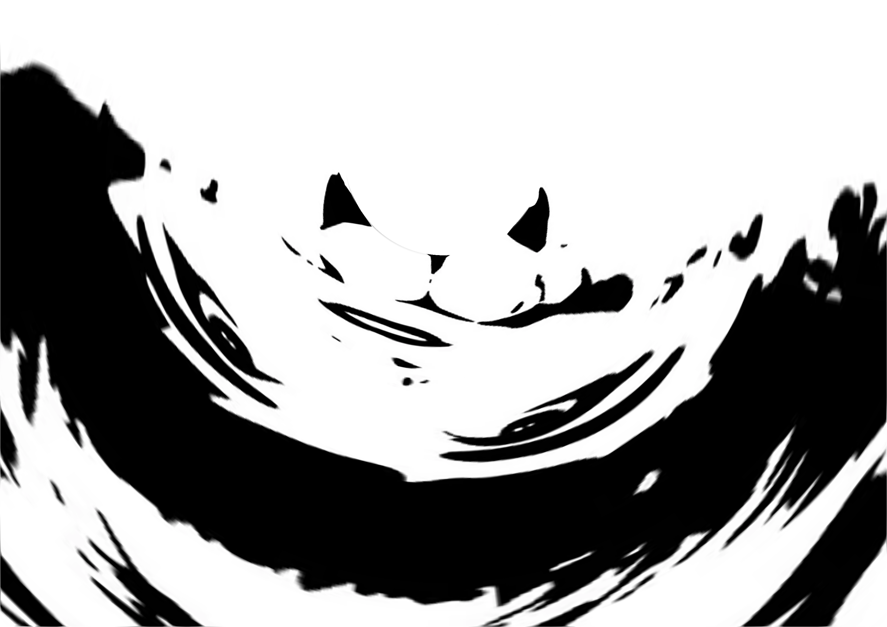
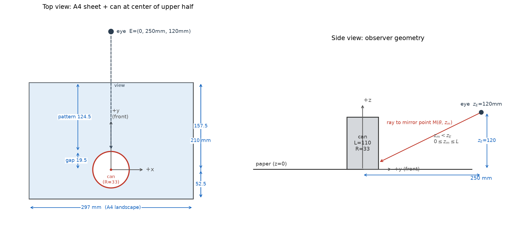

# Cylindrical Mirror Anamorphosis — A4 Distortion Generator

[English](#english) | [中文](#中文)

Turn any normal picture into a distorted print that **restores itself when reflected in a cylindrical mirror** — in practice, a 330 ml cola can standing on an A4 sheet.

<p align="center">
  
  
  
</p>

*Left: input image (what you want to see in the can). Middle: the distorted A4 print this script produces. Right: how the middle print looks when reflected in the can — back to normal.*

---

<a id="english"></a>
## English

### 1. How it works

A convex cylindrical mirror bends light rays according to the law of reflection. For a fixed observer position, every point `(θ, z_m)` on the mirror surface reflects exactly one point `P(x_p, y_p)` of the sheet on the table. So the "restored image" (parameterized by the mirror surface) and the "distorted print" (the tabletop) are related by an exact, computable geometric map.

**Physical setup**

- **Cylinder**: a 330 ml cola can, radius **R = 33 mm**, height **L = 110 mm**
- **Paper**: A4 in **landscape** (297 × 210 mm) lying flat (z = 0)
- **Placement**: the can stands at the center of the paper's **upper half** — 148.5 mm from the left/right edges, 52.5 mm from the top edge. The pattern wraps around the can (the circular footprint is cut out of the image)
- **Observer**: eye at **E = (0, 250 mm, 120 mm)** — in front of the can, slightly above its rim



**The mapping (mirror coordinates → paper coordinates)**

Parameterize the mirror by `(θ, z_m)` where θ is the angle around the cylinder axis and `z_m` the height of the reflection point. For a mirror point `M = (R cosθ, R sinθ, z_m)` with outward normal `n = (cosθ, sinθ, 0)` and eye `E = (0, y_E, z_E)`, the law of reflection `r = i − 2(i·n)n` gives an **analytic solution** for the paper point `P = (x_p, y_p, 0)`:

$$
x_p(\theta,z_m) = \frac{\cos\theta\,\bigl[R(z_E-2z_m) + 2\,z_m\,y_E\sin\theta\bigr]}{z_E - z_m},
\qquad
y_p(\theta,z_m) = \frac{R(z_E-2z_m)\sin\theta - z_m\,y_E\cos 2\theta}{z_E - z_m}
$$

(valid for `z_m < z_E`). The script uses exactly this forward map: it samples the useful mirror region on a `(θ, z_m)` grid, maps the input image onto that grid, evaluates `P` for every sample, and scatters/interpolates the points onto a 300-dpi A4 raster (SciPy `griddata`).

**Properties worth knowing**

- The map is strongly **non-linear**: straight lines on the paper bend into curves on the mirror, and vice versa.
- Only the **front half** of the can (`0 < θ < π`) is visible to a single observer; the narrow 19.5 mm strip of paper *behind* the can is mostly hidden by the can itself.
- The usable mirror height is capped by `min(L, z_E)` **and** by the paper edges — with the default geometry only the lower ~55 mm of the can is actually used. **Making the can taller changes nothing** unless the eye is raised too.
- The script flips the input image vertically before processing: the print is *supposed* to look upside-down/odd on paper; the mirror flips it back.

### 2. Installation

Python 3.8+, then:

```bash
pip install numpy scipy pillow
```

### 3. Usage

```bash
# Default: generates a built-in test pattern and its A4 distortion
python anamorph.py

# Real use: your own image
python anamorph.py your_image.png -o a4_anamorph.png

# Full parameter control
python anamorph.py your_image.png -o a4_anamorph.png --y_E 300 --z_E 130 --L 110 --dpi 300
```

Each run produces **two files**:

| Output | Content |
|---|---|
| `a4_anamorph.png` | The distorted A4 print (300 dpi, exact 297×210 mm) |
| `a4_anamorph_preview.png` | The image as seen **in the can** — a screen preview so you can verify content/orientation *before* printing |

**CLI parameters**

| Parameter | Default | Meaning |
|---|---|---|
| `input` | built-in test pattern | Input image (any format Pillow reads) |
| `-o, --output` | `a4_anamorph.png` | Output path of the A4 print |
| `--y_E` | 250 | Observer distance in front of the can (mm) |
| `--z_E` | 120 | Observer eye height (mm) |
| `--L` | 110 | Cylinder height (mm) |
| `--dpi` | 300 | Output resolution |

> Recommended observer range: `y_E ∈ [200, 350]`, `z_E ∈ [110, 150]`. Closer/lower → more extreme distortion; farther/higher → milder.

### 4. Input image guidelines

| Aspect | Recommendation | Why |
|---|---|---|
| **Aspect ratio** | ≈ **1.9 : 1** (w : h) | Matches the physical aspect of the usable mirror area (~104 mm × 54 mm arc). Other ratios still work (a square input like the demo simply gets resampled) but add vertical stretch |
| **Resolution** | short side ≥ 600 px | The strong distortion magnifies pixels near the can |
| **Content** | Bold shapes, large color blocks, thick text, high-contrast portraits (stencil style works great) | Fine texture/smooth gradients smear in the stretched zones |

### 5. Printing & viewing

1. Print the output PNG at **100% scale (no "fit to page"!)** on A4 — the raster is exactly 297 × 210 mm at 300 dpi.
2. Place the can on the **white circle** at the center of the paper's upper half.
3. Put your eye **250 mm in front of the can, 120 mm above the table** (roughly one arm's length, eye level with the can top). The image in the can should match the `*_preview.png` file.

> Don't be surprised that the print looks like abstract swirls with upside-down content — that is expected. Check `a4_anamorph_preview.png` on screen instead of judging the print.

### 6. Repository layout

```
├── anamorph.py        # the generator (single-file, no config)
├── gen_setup_fig.py   # regenerates images/setup.png
├── compare_L.py       # experiment: effect of cylinder height L (conclusion: none, unless eye raised)
├── images/            # figures used by this README
└── test_*.png         # example inputs/outputs
```

---

<a id="中文"></a>
## 中文

### 1. 原理

凸圆柱面镜按反射定律弯折光线。固定观察者位置后，镜面上每一点 `(θ, z_m)` 恰好反射桌面上的一点 `P(x_p, y_p)`。于是"罐中还原像"（用镜面坐标参数化）与"纸面变形图"（桌面坐标）之间是一个精确、可计算的几何映射——这正是变形画（anamorphosis）的数学基础。

**实物配置**

- **圆柱**：330 ml 可乐罐，半径 **R = 33 mm**，罐高 **L = 110 mm**
- **纸**：A4 **横向**摆放（297 × 210 mm），平铺于桌面（z = 0）
- **位置**：罐子立在纸的**上半矩形中心**——距左右边各 148.5 mm，距上边 52.5 mm。图案**环绕罐子一圈**（罐底圆形区域挖空）
- **观察者**：眼睛位于 **E = (0, 250 mm, 120 mm)**——罐正前方，略高于罐顶


**映射公式（镜面坐标 → 纸面坐标）**

用 `(θ, z_m)` 参数化镜面：θ 为绕圆柱轴的周向角，`z_m` 为反射点高度。镜面点 `M = (R cosθ, R sinθ, z_m)`，外法线 `n = (cosθ, sinθ, 0)`，眼睛 `E = (0, y_E, z_E)`。由反射定律 `r = i − 2(i·n)n` 可解出纸面点 `P = (x_p, y_p, 0)` 的**解析解**：

$$
x_p(\theta,z_m) = \frac{\cos\theta\,\bigl[R(z_E-2z_m) + 2\,z_m\,y_E\sin\theta\bigr]}{z_E - z_m},
\qquad
y_p(\theta,z_m) = \frac{R(z_E-2z_m)\sin\theta - z_m\,y_E\cos 2\theta}{z_E - z_m}
$$

（成立条件 `z_m < z_E`）。脚本用的正是这个正向映射：在镜面有效区上布 `(θ, z_m)` 网格，把输入图贴到网格上，逐点算出 `P`，再散点插值（SciPy `griddata`）到 300 dpi 的 A4 栅格上。

**几点重要性质**

- 映射**强非线性**：纸上的直线在镜中变曲线，反之亦然。
- 单个观察者只能看到罐的**前半周**（`0 < θ < π`）；罐后方那条 19.5 mm 窄带大部分被罐体自身遮挡，对正前方的观察者不可见。
- 镜面有效高度受 `min(L, z_E)` **和纸边界**双重限制——默认几何下实际只用到罐下部约 55 mm。**单纯加高罐子没有任何效果**，必须同时抬高眼睛。
- 脚本在处理前会把输入图**上下翻转**：所以打印出来的纸看着是倒的/怪异的，这是正常且正确的——罐子会把它翻回来。

### 2. 安装

Python 3.8+，然后：

```bash
pip install numpy scipy pillow
```

### 3. 用法

```bash
# 默认：生成内置测试图及其 A4 变形图
python anamorph.py

# 实际使用：换成你自己的图
python anamorph.py 你的图.png -o a4_anamorph.png

# 全参数控制
python anamorph.py 你的图.png -o a4_anamorph.png --y_E 300 --z_E 130 --L 110 --dpi 300
```

每次运行产出**两个文件**：

| 输出 | 内容 |
|---|---|
| `a4_anamorph.png` | A4 变形图（300 dpi，精确 297×210 mm） |
| `a4_anamorph_preview.png` | **罐中看到的画面**——打印前先在屏幕上核对内容/方向，不用反复试印 |

**命令行参数**

| 参数 | 默认 | 含义 |
|---|---|---|
| `input` | 内置测试图 | 输入图（Pillow 支持的任意格式） |
| `-o, --output` | `a4_anamorph.png` | A4 输出路径 |
| `--y_E` | 250 | 观察者距罐前方距离（mm） |
| `--z_E` | 120 | 观察者眼高（mm） |
| `--L` | 110 | 圆柱高（mm） |
| `--dpi` | 300 | 输出分辨率 |

> 推荐观察范围：`y_E ∈ [200, 350]`，`z_E ∈ [110, 150]`。越近/越低变形越夸张，越远/越高越缓和。

### 4. 输入图建议

| 项目 | 建议 | 原因 |
|---|---|---|
| **宽高比** | 接近 **1.9 : 1**（宽:高） | 匹配镜面有效区的物理弧长比（约 104 × 54 mm）。其他比例也能跑（示例就是 1:1 的方图，自动重采样），但会额外引入纵向拉伸 |
| **分辨率** | 短边 ≥ 600 px | 靠近罐子的强变形区会放大像素 |
| **内容** | 大色块、粗线条、粗文字、高对比度人像（剪影/版画风格效果极佳） | 细密纹理和平滑渐变在拉伸区会糊掉 |

### 5. 打印与观察

1. 输出 PNG 按 **100% 缩放打印**（关闭"适应页面"！）到 A4——栅格在 300 dpi 下精确等于 297 × 210 mm。
2. 把罐子放在纸上半部中央的**白色圆**上。
3. 眼睛放在罐前方 **250 mm**、离桌面 **120 mm** 处（大约一臂距离，眼与罐顶齐平略高）。罐中看到的画面应与 `*_preview.png` 一致。

> 打印出来的纸看着像一团抽象漩涡、内容还是倒的——这是预期行为，别以打印图判断效果，看屏幕上的 `a4_anamorph_preview.png`。

### 6. 仓库结构

```
├── anamorph.py        # 生成器（单文件，免配置）
├── gen_setup_fig.py   # 重新生成 images/setup.png
├── compare_L.py       # 实验脚本：罐高 L 的影响（结论：除非同时抬眼，否则无影响）
├── images/            # README 用图
└── test_*.png         # 示例输入/输出
```
